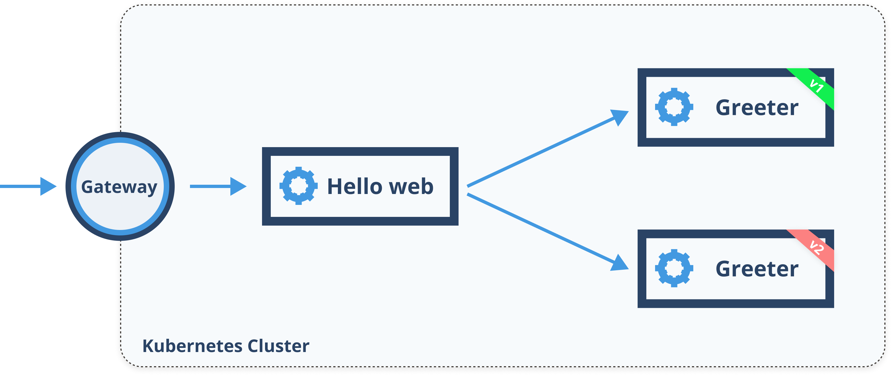
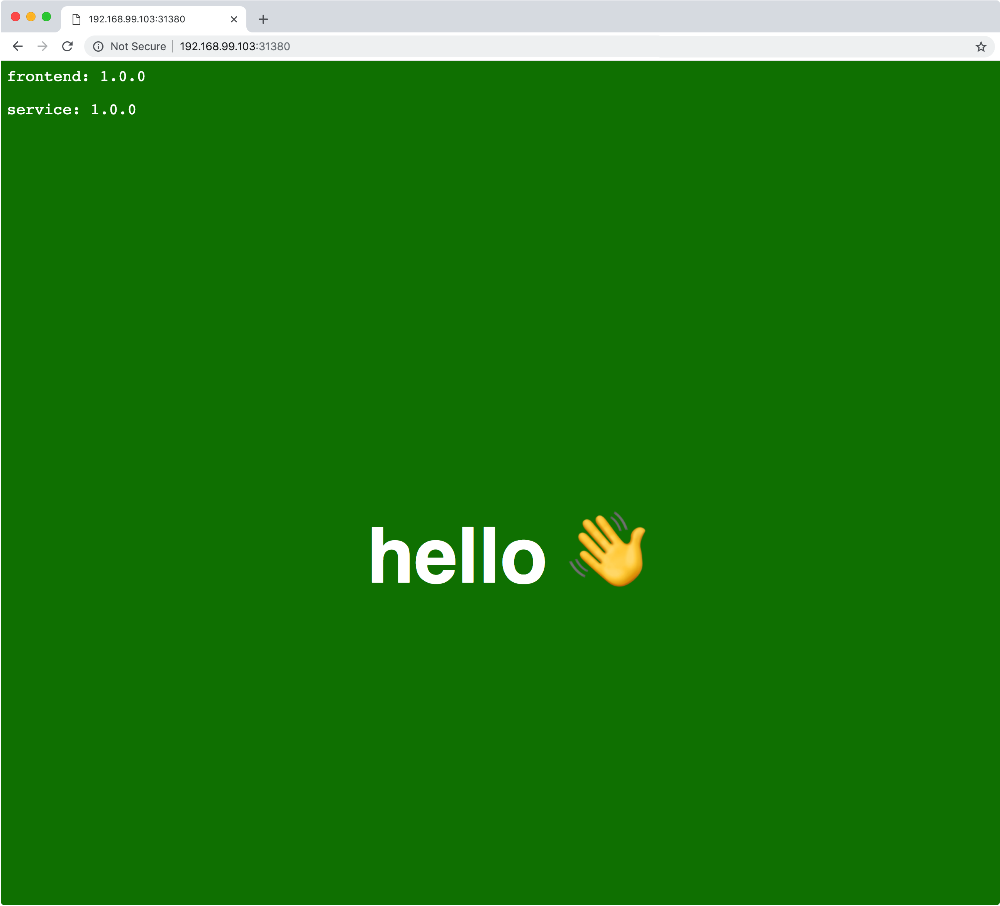
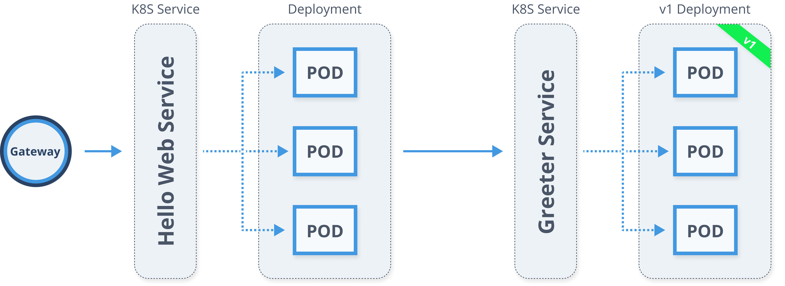
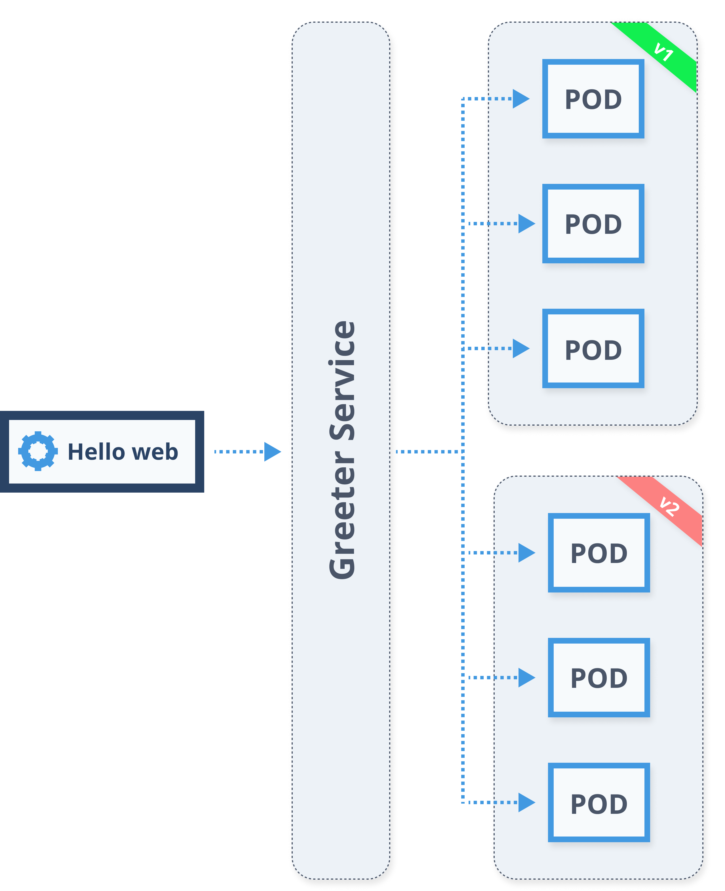
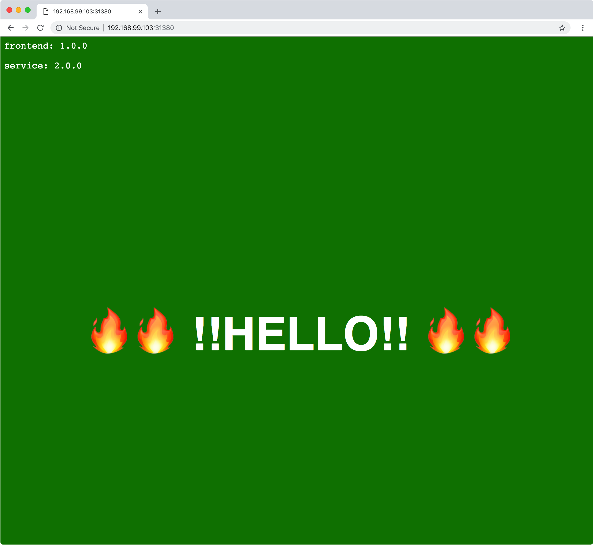

In this blog, I will talk about how to get started with routing traffic between your services using service mesh. You will learn how to set up an *Ingress* resource to allow traffic into your cluster as well as an *Egress* resource to enable traffic to exit your cluster. I will explain how to deploy a new version of the service and run it alongside with the released production version of the service without disrupting production traffic. With both service versions deployed we will gradually release the new version and start routing a percentage of incoming requests to the latest version. With this basic set up in place, we will show how to do more advanced with match conditions on request parameters (e.g. URL, headers). Finally, I will talk about mirroring production traffic to a newly deployed service without impacting end-users.

## Deploying sample services

In this blog, you will be using two different services. The first one, called Hello Web, is a simple frontend web application that makes calls to another service, called the Greeter Service. We will be using multiple versions of the Greeter Service to demonstrate the use of traffic routing. The diagram below shows the two services.



But, to get started, we will deploy the Hello Web and Greeter Service V1. Let's start with the Kubernetes deployment and service for the Greeter Service V1 and deploy the resources to the `default` namespace on your Kubernetes cluster.

```yaml
cat <<EOF | kubectl create -f -
apiVersion: apps/v1
kind: Deployment
metadata:
  name: greeter-service-v1
  labels:
    app: greeter-service
    version: v1
spec:
  replicas: 3
  selector:
    matchLabels:
      app: greeter-service
      version: v1
  template:
    metadata:
      labels:
        app: greeter-service
        version: v1
    spec:
      containers:
        - image: learnistio/greeter-service:1.0.0
          imagePullPolicy: Always
          name: svc
          ports:
            - containerPort: 3000
---
kind: Service
apiVersion: v1
metadata:
  name: greeter-service
  labels:
    app: greeter-service
spec:
  selector:
    app: greeter-service
  ports:
    - port: 3000
      name: http
EOF
```

If all goes well, you will see an output like this:

```sh
deployment.apps/greeter-service-v1 created
service/greeter-service created
```

Similarly, let's create the Kubernetes deployment and service for the Hello Web frontend service. Note that in this deployment we are declaring an environment variable called `GREETER_SERVICE_URL`. This environment variable tells our web frontend the address of the Greeter Service. 

```yaml
cat <<EOF | kubectl create -f -
apiVersion: apps/v1
kind: Deployment
metadata:
  name: helloweb
  labels:
    app: helloweb
    version: v1
spec:
  replicas: 3
  selector:
    matchLabels:
      app: helloweb
      version: v1
  template:
    metadata:
      labels:
        app: helloweb
        version: v1
    spec:
      containers:
        - image: learnistio/hello-web:1.0.0
          imagePullPolicy: Always
          name: web
          ports:
            - containerPort: 3000
          env:
            - name: GREETER_SERVICE_URL
              value: 'http://greeter-service.default.svc.cluster.local:3000'
---
kind: Service
apiVersion: v1
metadata:
  name: helloweb
  labels:
    app: helloweb
spec:
  selector:
    app: helloweb
  ports:
    - port: 3000
      name: http
EOF
```

To watch the deployment, you can run `kubectl get pods --watch` - this shows you the status changes of each pod. You can also just run the `kubectl get pods` command to shows all pods and their current status:

```sh
NAME                                 READY   STATUS    RESTARTS   AGE
greeter-service-v1-c4f8d55cb-2gbrr   2/2     Running   0          4m48s
greeter-service-v1-c4f8d55cb-h7ssg   2/2     Running   0          4m48s
greeter-service-v1-c4f8d55cb-pjxcc   2/2     Running   0          4m48s
helloweb-8567cfc9f8-5ctxm            2/2     Running   0          4m35s
helloweb-8567cfc9f8-gcwcc            2/2     Running   0          4m35s
helloweb-8567cfc9f8-p9krk            2/2     Running   0          4m35s
```

Notice we have three replicas of each service and each pod has two containers - one is the service container and the second one is the Envoy proxy that was automatically injected.

## Accessing Deployed Services

By default, any service running inside the service mesh is not automatically exposed outside of the cluster, which means that we can't get to it from the public Internet. Up until Istio version `1.X.X`, services within the mesh didn't have access to anything running outside of the cluster either. However, that has changed with the Istio version used in this book, and you can access any services, APIs, and endpoints outside of your cluster, without explicitly allowing access to them. Note that you should still review all your services and ensure they are only accessing what they need to access and prevent them from accessing any other (unknown) external resources.

To allow incoming traffic to reach a service running inside the cluster, you need to create an external load balancer first. As part of the installation, Istio deploys an `istio-ingressgateway` service that is of type `LoadBalancer`. Together with this service and an Istio Gateway resource, you can configure access to services running inside the cluster. 

If you run `kubectl get svc istio-ingressgateway -n istio-system`, you will get an output similar to this one: 

```sh
NAME                   TYPE           CLUSTER-IP      EXTERNAL-IP       PORT(S)...
istio-ingressgateway   LoadBalancer   10.107.249.46   <pending>         80:31380/TCP... 
```

The above output shows the Istio ingress gateway of type LoadBalancer. If you're using a Minikube cluster you will notice how the external IP column shows text `<pending>` - that is because we don't have a real external load balancer as everything runs locally. With a cluster running in the cloud from any cloud provider, we would see an actual IP address there - that IP address is where the incoming traffic enters the cluster. If you are using Docker for Mac/Windows, you will see `localhost` under the EXTERNAL-IP column.

We will be accessing the service in the cluster frequently, so we need to know which address to use. The address we are going to use depends on where the Kubernetes cluster is running. 

### If using Minikube

Minikube has a command called `minikube tunnel`. This command creates networking routes from your machine into the Kubernetes cluster as well as allocates IPs to services marked with LoadBalancer. What this means is that you can access your exposed service using an external IP address, just like you would when you're running Kubernetes in the cloud. 

To use the tunnel command, open a new terminal window and run `minikube tunnel`. You should see an output similar to this one: 

```yaml
$ minikube tunnel
Status:
    machine: minikube
    pid: 43606
    route: 10.96.0.0/12 -> 192.168.99.104
    minikube: Running
    services: [istio-ingressgateway]
  errors:
    minikube: no errors
    router: no errors
    loadbalancer emulator: no errors
```

If you run the `kubectl get svc istio-ingressgateway -n istio-system` command to get the ingress gateway service, you will notice an actual IP address in the `EXTERNAL-IP` column. It should look something like this: 

```sh
$ kubectl get svc istio-ingressgateway -n istio-system
NAME                   TYPE           CLUSTER-IP       EXTERNAL-IP
PORT(S)
istio-ingressgateway   LoadBalancer   10.107.235.182   **10.99.132.130**
.......
```

Now you can use the external IP address (e.g. `10.99.132.130`) as the public entry point to your cluster. Set this value to the GATEWAY variable like this:

```sh
export GATEWAY=[EXTERNAL-IP]
```

### If using Docker for Mac/Windows

When using Docker for Mac/Windows, the Istio ingress gateway is exposed on `http://localhost:80`, so you can set the `GATEWAY` variable like this:

```sh
export GATEWAY=http://localhost
```

### If using hosted Kubernetes

If you're using hosted Kubernetes, run the `kubectl get svc istio- ingressgateway -n istio-system` command and use the external IP value. 


For the rest of the book, we will be referring to the `GATEWAY` environment variable in all examples when accessing the services. 

## Using Istio Gateway

Now that you have the `GATEWAY` variable set up, you can try and access it. Unfortunately, the connection will be refused:

```sh
$ curl -v $GATEWAY
*   Trying 10.99.132.130...
* TCP_NODELAY set
* Connection failed
* connect to 10.99.132.130 port 80 failed: Connection refused
* Failed to connect to 10.99.132.130 port 80: Connection refused
* Closing connection 0
curl: (7) Failed to connect to 10.99.132.130 port 80: Connection refused
```

You need a Gateway resource for the ingress gateway to know where to route the requests when they hit the cluster. The ingress and the gateway resource operate at the edge of the service mesh and are used to enable incoming traffic to the cluster. Here's how a minimal Istio Gateway resource looks like:

```yaml
apiVersion: networking.istio.io/v1alpha3
kind: Gateway
metadata:
  name: gateway
spec:
  selector:
    istio: ingressgateway
  servers:
    - port:
        number: 80
        name: http
        protocol: HTTP
      hosts:
        - '*'
```

The snippet above creates an Istio Gateway resource with the `istio: ingressgateway` selector. An istio-ingressgateway pod with the label `istio=ingressgateway` got created as part of the Istio installation, and the gateway resource with the matching selector `istio=ingressgateway` adds the routing config to the istio-ingressgateway pod. 

If you run `kubectl get pod --selector="istio=ingressgateway" --all-namespaces` you will get pods that are labeled with `ingressgateway`. The command returns an ingress gateway pod that's running in the `istio-system` namespace and is installed as part of the Istio installation. The ingress gateway receives all incoming traffic to the cluster and will ensure the requests get redirected to services in the cluster, based on the settings defined in the Gateway resource.

Under `servers` you define which hosts will this gateway proxy. We are using `*` which means we want to proxy all requests, regardless of the hostname.

> Using Real Domains
>
> In the real world, the host gets set to the actual domain name (e.g. www.example.com) where cluster services get accessed. The `*` should be only used for testing and in local scenarios and not in production.

With the host and port combination above, we are allowing incoming HTTP traffic to port `80` for any host (`*`). Let's deploy our own Gateway resource to the `default` namespace:

```sh
cat <<EOF | kubectl create -f -
apiVersion: networking.istio.io/v1alpha3
kind: Gateway
metadata:
  name: gateway
spec:
  selector:
    istio: ingressgateway
  servers:
    - port:
        number: 80
        name: http
        protocol: HTTP
      hosts:
        - '*'
EOF
```


Let's try and make a request to the $GATEWAY endpoint now.

```sh
$ curl -v $GATEWAY
*   Trying 10.99.132.130...
* TCP_NODELAY set
* Connected to 10.99.132.130 (10.99.132.130) port 80 (#0)
> GET / HTTP/1.1
> Host: 10.99.132.130
> User-Agent: curl/7.64.1
> Accept: */*
>
< HTTP/1.1 404 Not Found
< date: Fri, 09 Oct 2020 21:50:08 GMT
< server: istio-envoy
< content-length: 0
<
* Connection #0 to host 10.99.132.130 left intact
* Closing connection 0
```

Notice this time we get back an HTTP 404 response. The request is getting to the ingress gateway, but there's nothing behind it and the gateway doesn't know where or how to route the request.

Let's also look at the logs from the Istio ingress gateway pod to see the requests coming in:

```sh
$ kubectl get pod --selector="istio=ingressgateway" --all-namespaces
NAMESPACE      NAME                                    READY   STATUS    RESTARTS   AGE
istio-system   istio-ingressgateway-7bd5586b79-nzbm8   1/1     Running   0          11m

$ kubectl logs istio-ingressgateway-7bd5586b79-nzbm8 -n istio-system
...
[2020-10-09T21:50:08.971Z] "GET / HTTP/1.1" 404 - "-" "-" 0 0 0 - "192.168.99.1" "curl/7.64.1" "697452d4-08c9-9370-a3c2-2cbca13b34c5" "10.99.132.130" "-" - - 172.17.0.5:8080 192.168.99.1:58015 - default
....
```

This is telling us that the incoming traffic did reach the ingress gateway. If you think about it, that response makes sense as we only defined the port and hosts with the Gateway resource, but haven't specified an actual destination for the traffic. To do that, we use another Istio resource called virtual service (`VirtualService`).

## Virtual Services

Since we will be talking a lot about *services* throughout the book, let's make a quick note on the terminology. The word *service* is overloaded and can mean a bunch of different things, depending on the context. Whenever I mention the word *service*, I will make sure to use it in a context and say for example a "Kubernetes service" when I am talking about the Kubernetes `Service` resource or "Virtual service" when I talk about the Istio virtual service resource. In addition to this, I will also refer to the sample apps service we will use throughout the book - Hello Web and Greeter Service - either as services or apps.

Istio's Virtual Service resource is used to configure how the requests get routed within the mesh. Virtual service is one of the resources you will use heavily throughout the book. Let's look at an example of the Istio virtual service resource:

```yaml
apiVersion: networking.istio.io/v1alpha3
kind: VirtualService
metadata:
  name: helloweb
spec:
  hosts:
    - 'helloweb.dev'
  gateways:
    - gateway
  http:
    - route:
      - destination:
          host: helloweb.default.svc.cluster.local
          port:
            number: 3000
```

The host in the virtual service is the address used by clients when attempting to connect to the service. In our case, you will use the `helloweb.dev` as the host. Using an actual host instead of an asterisk (e.g. `*`) will allow us to have multiple services deployed and accessed through the gateway at the same time. A potential downside is that you will have to remember to include a `Host: [hostname]` header with each curl request you make. Besides, if you want to access services through the browser, you will need to install an extension that allows you to modify the headers. If using Chrome, you can try the [ModHeader extension](https://mod-header.appspot.com/help.html). 

In addition to the hosts setting, we are also specifying a name of the gateway resource (`gateway`) you create before, and with this setting, you are allowing traffic to come through the gateway and hit the destination host defined in the virtual service (`helloweb.default.svc.cluster.local`).

The route and destination portion are used to define the host and the port number of the Kubernetes service you are trying to reach. The host in our case is the Kubernetes service DNS name - `helloweb.default.svc.cluster.local`, just like the hostname.

A> The reason for using fully qualified service names is because of the way Istio interprets the short names (e.g. `helloweb`). Istio expands the short name to `helloweb.[namespace].svc.cluster.local`. However, the `namespace` gets replaced with the namespace that contains the virtual service and _not_ with the namespace the `helloweb` service runs in. Always make sure to use fully qualified names, as to avoid confusion.

With the help of a virtual service resource, one can also configure multiple destinations, and this is something that's explained later in the book where we talk about traffic splitting.

Let's go ahead and deploy the virtual service:

```sh
cat <<EOF | kubectl apply -f -
apiVersion: networking.istio.io/v1alpha3
kind: VirtualService
metadata:
  name: helloweb
spec:
  hosts:
    - 'helloweb.dev'
  gateways:
    - gateway
  http:
    - route:
      - destination:
          host: helloweb.default.svc.cluster.local
          port:
            number: 3000
EOF
```

With the virtual service deploy, you can try the same `curl` command:

```sh
$ curl -H "Host: helloweb.dev" $GATEWAY
<link rel="stylesheet" type="text/css" href="css/style.css" />

<pre>frontend: 1.0.0</pre>
<pre>service: 1.0.0</pre>


<div class="container">
    <h1>hello 👋 </h1>
</div>
```

A> You can also open the `$GATEWAY` address in your browser for the UI experience.

The traffic is now flowing through the Istio ingress gateway, the virtual service and finally, it hits the Hello Web frontend, which in turn calls the Greeter service to get the greeting message. 

## Service Entries

Now that we know how to allow traffic inside the cluster let's figure out how can we enable services to make calls outside of the cluster as well.

To demonstrate the use of the service entry resource we are going to deploy a service called Movie web. This simple website makes an API call to `themoviedb.org` to retrieve a list of currently popular movies and displays them.

Before you can deploy the Movie web, go to http://themoviedb.org and obtain an API key. Once you get the API key, replace the `<API_KEY_HERE>` in the YAML file with the actual API key. Now you can deploy the Movie web:

```bash
cat <<EOF | kubectl apply -f -
apiVersion: apps/v1
kind: Deployment
metadata:
  name: movieweb
  labels:
    app: movieweb
    version: v1
spec:
  replicas: 3
  selector:
    matchLabels:
      app: movieweb
      version: v1
  template:
    metadata:
      labels:
        app: movieweb
        version: v1
    spec:
      containers:
        - name: movieweb
          image: learnistio/movie-web:1.0.0
          imagePullPolicy: Always
          ports:
            - containerPort: 3000
          env:
            - name: THEMOVIEDB_API_KEY
              value: '<API_KEY_HERE>'
---
kind: Service
apiVersion: v1
metadata:
  name: movieweb
  labels:
    app: movieweb
spec:
  selector:
    app: movieweb
  ports:
    - port: 3000
      name: http
EOF
```

With the Kubernetes service and deployment created, you also need to deploy a virtual service:

```sh
cat <<EOF | kubectl apply -f -
apiVersion: networking.istio.io/v1alpha3
kind: VirtualService
metadata:
  name: movieweb
spec:
  hosts:
    - '*'
  gateways:
    - gateway
  http:
    - route:
      - destination:
          host: movieweb.default.svc.cluster.local
          port:
            number: 3000
EOF
```

Note that we are setting the `hosts` to `*`. This means that we don't need to specify a Host header to access the movieweb application.

In the earlier versions of Istio, any requests made to the outside of the cluster were automatically blocked and you would get an error like this:

```sh
$ curl -H "Host: movieweb.dev" $GATEWAY
{"error":"Error accessing: api.themoviedb.org"}
```

This setting has been changed in the recent versions of Istio and traffic going outside of the cluster is now enabled by default. To control the traffic exiting the service mesh, you can use another Istio resource called *ServiceEntry*. With this resource, you can make any service (external to the mesh or internal services, not part of the service registry) become part of the service registry.

When you use the service entry resource you are essentially making an external service part of the service mesh and "pulling" it in. Once you have an external service as part of the service mesh, it allows you to apply any other mesh patterns to it as well - for example, you can do traffic splitting, failure injection and more, and it doesn't matter that the services are external. Just like you have a Gateway resource defined for incoming requests, you could also set another gateway resource for all egress traffic (traffic exiting the cluster).

Here's how a service entry resource looks like for the `api.themoviedb.org`:

```yaml
apiVersion: networking.istio.io/v1alpha3
kind: ServiceEntry
metadata:
  name: movieweb
spec:
  hosts:
    - api.themoviedb.org
  ports:
    - number: 443
      name: https
      protocol: HTTPS
  resolution: DNS
  location: MESH_EXTERNAL
```

The main parts that are interesting here are the entries under `hosts` - this is the actual host we call from the Movie web service. The port number (`443`) and protocol (`https`) are self-explanatory and should match the port/protocol used when accessing the external service.

The `resolution: DNS` setting defines how to resolve the IPs. There are three options you can pick from: `NONE`, `STATIC` and `DNS` - we are using the DNS setting because we want the proxy to attempt
to resolve the IP address of the host during the requests. You would use the `STATIC` parameter if you had specified the static IP addresses in the service entry, and `NONE` if you don't want to do any resolution - this assumes the destination is already resolved and forwards the connection to the destination IP address.

Lastly, with the location set to `MESH_EXTERNAL` you are saying that this is an external service that is consumed through the APIs. The other possible option for the location setting is `MESH_INTERNAL`. Typically, this option is used for services that should be part of the mesh, but are perhaps running on different infrastructure and not necessarily in the same cluster.

Let's deploy the service entry resource for the Movie web and allow the Movie web to access the API:

```sh
cat <<EOF | kubectl apply -f -
apiVersion: networking.istio.io/v1alpha3
kind: ServiceEntry
metadata:
  name: movieweb
spec:
  hosts:
    - api.themoviedb.org
  ports:
    - number: 443
      name: https
      protocol: HTTPS
  resolution: DNS
  location: MESH_EXTERNAL
EOF
```

If you open the `http://$GATEWAY` in your browser or use curl you will get a web site with a list of movies, together with posters and descriptions, just like in it's shown below.


Let's delete the MovieWeb resources before you continue:

```sh
kubectl delete deploy movieweb
kubectl delete svc movieweb
kubectl delete vs movieweb
```


## Basic Traffic Splitting

Up until now, we were dealing with only one version of the service, and we explained how to allow incoming requests to the cluster, and use a service entry resource to give the mesh service access to external services and APIs. Sometimes having a single frontend that calls one API is enough, however in most cases,
one has multiple services running within the cluster and talking to each other. All these services can evolve at their own pace, so you can quickly end up with numerous different versions. How do you go about releasing new service versions and how to ensure and get confidence that the new version will work as good as the existing one?

This is where the service mesh can help out. This section will show you how to take a new service version, deploy it, and then gradually release it to production, while at the same time minimizing the risk to end-users.

To demonstrate traffic splitting, we will use the Hello Web and two different versions of the Greeter service we introduced at the beginning of this blog. 

If you open the `GATEWAY` URL, you should see something similar to the figure below. Hello web is calling the V1 version of the Greeter service and displaying the message it gets back.



The V1 version of the Greeter service is excellent and helpful, but we'd like to release a v2 of the Greeter service. Because we want to minimize the risks of exposing users to a broken version of the service, we want to do gradual roll-out, while still keeping the existing service up and running. Once we've deployed the new version, we can start releasing it gradually by routing 10% of all incoming requests to the latest version, while the rest of the requests (90%) still goes to the existing version.

### Splitting Traffic By Weight

With Istio, you can route requests by assigning weights to each version of the service - weights translate to the percentage of the incoming requests to route to that version of the service. At the moment, the traffic through the services looks like shown below.



Traffic comes from the Internet and hits the load balancer and gateway and then goes to the `helloweb` Kubernetes service. After that `helloweb` Kubernetes services load balances the traffic between all pods that have the label `app: helloweb` set. If you look at the deployment YAML for the Hello web, you will notice we have the following labels defined: 

```yaml
  labels:
    app: helloweb
    version: v1
```

From the Hello web pod, we make a call to the Greeter service using it's DNS name (http://greeter-service.default.svc.cluster.local:3000) - this DNS name gets automatically created when Kubernetes service is deployed. The Kubernetes service will then in turn load balance between all pods labeled with the *app: greeter-service*. Similarly, as in the Hello web deployment, we have these labels defined in the Greeter service deployment v1:

```yaml
  labels:
    app: greeter-service
    version: v1
```

How would we go about deploying a second version of the greeter service?

1. We create an entirely separate Kubernetes deployment that has the label `version: v2`, in addition to the `app: greeter-service` label. This deployment also uses a different Docker image with the v2 version of our service, but everything else in the YAML file is identical to the V1 version of the service.

2. We don't need to deploy another Kubernetes service as we already have the Kubernetes `greeter-service` deployed. We also shouldn't rename the service or deploy a different version of it, because the Hello Web relies on the DNS name (e.g. `http://greeter-service:3000`) to make calls to it.

Notice how the selector is defined in the greeter service Kubernetes service:

```yaml
  selector:
    app: greeter-service
```

This means that it doesn't have a clue about the greeter service versions, which is ok. However, if we would deploy the v2 of the greeter service and then reload the hello web, we would randomly get responses back from either v1 or v2 pods. This is shown blow.



If you remember when we talked about Istio's *VirtualService* resource, we briefly mentioned that one could define multiple destinations where requests can be routed to. This is exactly what we need to do. You can define a second destination like this:

```yaml
apiVersion: networking.istio.io/v1alpha3
kind: VirtualService
metadata:
  name: greeter-service
spec:
  hosts:
    - greeter-service
  http:
    - route:
      - destination:
          host: greeter-service.default.svc.cluster.local
          port:
            number: 3000
      - destination:
          host: greeter-service.default.svc.cluster.local
          port:
            number: 3000
```

However, this alone is not enough as we are not differentiating between service versions in any way - in both cases, we have the same host. We need to specify that we want only 10% of the requests going to V1 of the service and the rest of the traffic to go to the V2 version of the service.

For this purpose, Istio has a resource named *DestinationRule*. With this rule and the concept of subsets, you can specify how to distinguish between different versions of the service using labels on the Kubernetes pods. Any rules defined in the destination rule are applied to the request *after* virtual service routing occurs. Since we have two versions of the greeter service, we can create two subsets named `v1` and `v2` and define the labels that are used to distinguish between them (e.g. `version: v1` and `version: v2`). These labels get then applied to the Kubernetes service selectors. So the Greeter Kubernetes service is generic, and load balances between all pods with the `app: greeter-service`, but this destination rule and the `VirtualService` will additionally apply either `version: v1` or `version: v2` at the time of routing. 

Here's how a destination rule would look like for the greeter service:

```yaml
apiVersion: networking.istio.io/v1alpha3
kind: DestinationRule
metadata:
  name: greeter-service
spec:
  host: greeter-service.default.svc.cluster.local
  subsets:
    - name: v1
      labels:
        version: v1
    - name: v2
      labels:
        version: v2
```

With the destination rule in place, you will also need to update the virtual service to use these subsets. Here's a snippet that shows how to define the subsets and weights:

```yaml
...
- destination:
    host: greeter-service.default.svc.cluster.local
    port:
      number: 3000
    subset: v1
weight: 90

- destination:
    host: greeter-service.default.svc.cluster.local
    port:
      number: 3000
    subset: v2
weight: 10
...
```

We have added the subset to each of the destinations, as well as the weight that routes 10% of the requests to the new version (v2) and 90% of the requests to the existing, v1 version.

Now that we clarified how this works let's come up with a better plan of deploying the v2 version of the service, without disrupting any existing traffic.

As a first step, you need to deploy the destination rule - in this rule, you define the versions by creating a subset for each version, and we specify the traffic policy to use mutual TLS for connections.

```sh
cat <<EOF | kubectl apply -f -
apiVersion: networking.istio.io/v1alpha3
kind: DestinationRule
metadata:
  name: greeter-service
spec:
  host: greeter-service.default.svc.cluster.local
  subsets:
    - name: v1
      labels:
        version: v1
    - name: v2
      labels:
        version: v2
  trafficPolicy:
    tls:
      mode: ISTIO_MUTUAL
EOF
```

Next, you can deploy the updated virtual service that defines how the traffic should be routed - all traffic to the v1 version of the greeter service.

```sh
cat <<EOF | kubectl apply -f -
apiVersion: networking.istio.io/v1alpha3
kind: VirtualService
metadata:
  name: greeter-service
spec:
  hosts:
    - greeter-service.default.svc.cluster.local
  http:
    - route:
      - destination:
          host: greeter-service.default.svc.cluster.local
          port:
            number: 3000
          subset: v1
        weight: 100
      - destination:
          host: greeter-service.default.svc.cluster.local
          port:
            number: 3000
          subset: v2
        weight: 0
EOF
```

Remember that during this process, the service is "live", and there is no downtime at all. Finally, you can deploy the v2 version of the greeter service.

```sh
cat <<EOF | kubectl apply -f -
apiVersion: apps/v1
kind: Deployment
metadata:
  name: greeter-service-v2
  labels:
    app: greeter-service
    version: v2
spec:
  replicas: 3
  selector:
    matchLabels:
      app: greeter-service
      version: v2
  template:
    metadata:
      labels:
        app: greeter-service
        version: v2
    spec:
      containers:
        - name: svc
          image: learnistio/greeter-service:2.0.0
          imagePullPolicy: Always
          ports:
            - containerPort: 3000
EOF
```

Now you have v2 version deployed in the "dark mode" - no traffic is getting routed to that version at the moment. If you try and open the gateway URL now (don't forget to set the `helloweb.dev` Host header), you will get the same response back as earlier - all responses from v1 version only. Here's the output of the `kubectl get pods` command that shows that there are six greeter service pods deployed and running - three pods with the v1 version and three pods with the v2 version:

```sh
$ kubectl get pods
NAME                                 READY   STATUS    RESTARTS   AGE
greeter-service-v1-c4f8d55cb-2gbrr   2/2     Running   0          24h
greeter-service-v1-c4f8d55cb-h7ssg   2/2     Running   0          24h
greeter-service-v1-c4f8d55cb-pjxcc   2/2     Running   0          24h
greeter-service-v2-9974dc6-hdcz6     2/2     Running   0          2m42s
greeter-service-v2-9974dc6-qtk9q     2/2     Running   0          2m42s
greeter-service-v2-9974dc6-w78bl     2/2     Running   0          2m42s
helloweb-75cdb96474-c24hw            2/2     Running   0          24h
helloweb-75cdb96474-m6jcg            2/2     Running   0          24h
helloweb-75cdb96474-w4crk            2/2     Running   0          24h
```

Let's start redirecting 10% of the incoming traffic to the v2 version. To do that, you need to update the weights in the virtual service and re-deploy it.

```sh
cat <<EOF | kubectl apply -f -
apiVersion: networking.istio.io/v1alpha3
kind: VirtualService
metadata:
  name: greeter-service
spec:
  hosts:
    - greeter-service.default.svc.cluster.local
  http:
    - route:
        - destination:
            host: greeter-service.default.svc.cluster.local
            port:
              number: 3000
            subset: v1
          weight: 90
        - destination:
            host: greeter-service.default.svc.cluster.local
            port:
              number: 3000
            subset: v2
          weight: 10
EOF
```

If you open the gateway URL now and refresh the page a couple of times, you will eventually see the response from the v2 version of the greeter service as shown in figure below.



Now that you have the v2 deployed and partially released, the next thing that usually happens is that you monitor and observe your service for any issues and, if everything looks ok, you gradually route more and more traffic to the v2 version, while decreasing the percentage of requests going to the v1 version. This is accomplished by merely updating the weights in virtual service.

In case you discover any issues with the v2 version, you can easily roll back the percentage by either re-routing a portion or all traffic back to the v1 version of the service. It's never fun to discover issues; however, with this approach, you are only affecting a smaller portion of the users, instead of everyone. Note that the version is not the only thing to use for request routing. In the next section, we will talk about how to match the requests in a more detailed way. You could refine the traffic that gets routed to the new version even more precisely - by browsers, location, or anything else that can be figured out from the incoming requests.

Assuming you don't find any issues with the new version of the service, you will eventually end up with 100% of requests routed to the v2 version of the service and 0% routed to the v1 version. Once that happens, you can remove the v1 deployment without impacting anything (assuming no other services are using it).

A crucial thing to note here is the ability to monitor and observe your services from all angles. If you don't have any service monitoring in place, it's going to be hard to tell with a high degree of confidence when your service is behaving well or if it's broken. We will talk more about observability in a later blog.

For more on Istio traffic management check out the [second part](../istio-traffic-management-walkthrough-p2/) of this blog.