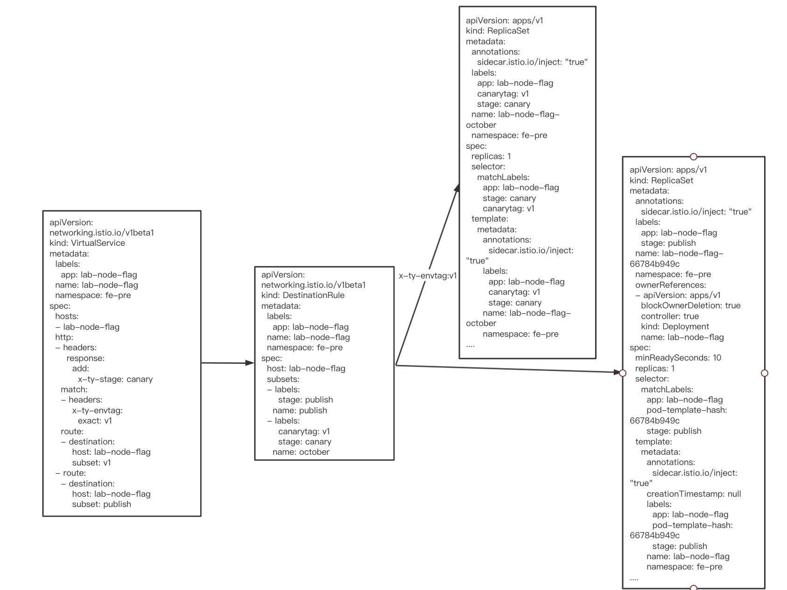
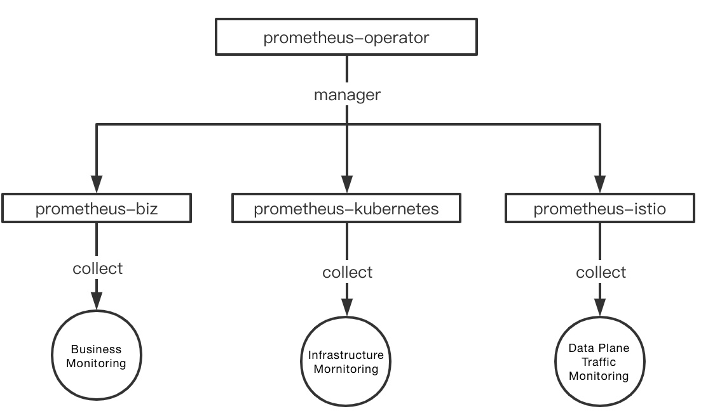
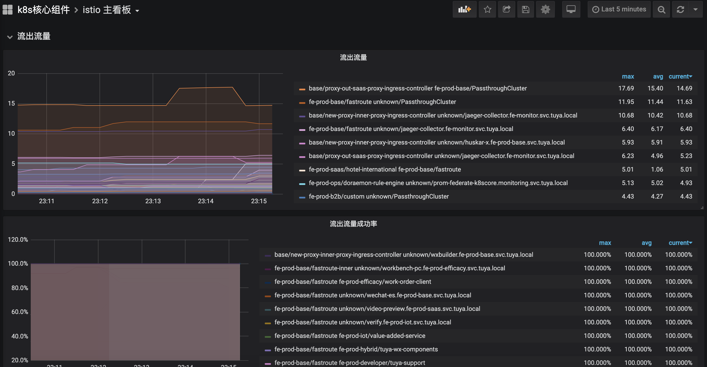
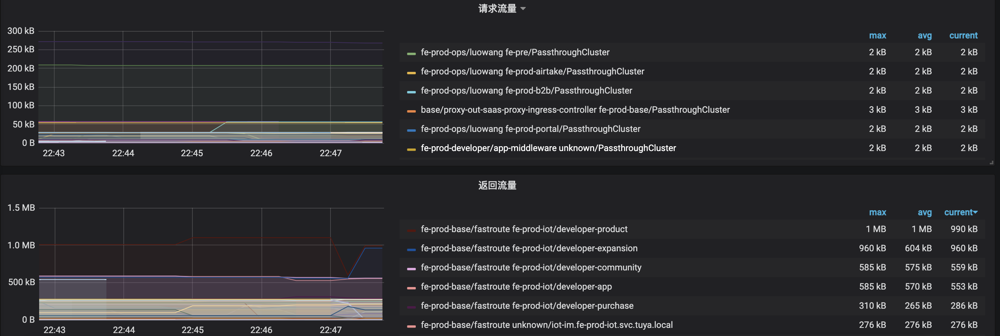

An Istio use case of Tuya Smart.


## Background
As the most active service mesh project at present, Istio provides numerous capabilities, including traffic management, security, and observability. Each capability is necessary for the management, operation and maintenance of services.  Istio's extensive capabilities also bring certain challenges to the operation and maintenance of complex systems. In terms of its capabilities and future scalability, Istio reimagines service management, bringing about new opportunities along with challenges.

Tuya Smart currently uses Istio control plane version 1.5.0 for its front-end business, allowing access to the Istio control plane by over 700 services and 1,100 pod instances which are responsible for the traffic control and capacity support of the largest business cluster at the front-end of Tuya Smart.

## Existing challenges faced by Tuya Smart in the development process

Tuya Smart’s Front-end Core Technology Team began to contact Kubernetes in 2018 and built a Kubernetes-based release platform to serve the front-end business team. However, as the business team grew larger, some issues began to emerge in the development and release process:

- Authentication issues in multi-branch parallel development
- Network issues caused by configuration complexity due to a multi-regional environment

Initially, we considered letting the business team make adjustments accordingly and deal with it internally. But as more of our teams experienced similar difficulties, we thought that gray release capabilities would be a better solution for these issues in the development and release process. In the daily pre-release environment, multiple branches release multiple grayscale versions, and distribute traffic to different versions according to different headers, ensuring that each feature branch has a separate instance for authentication, and does not affect each other.  The online environment provides grayscale capabilities for regression testing and acts as the last line of defense for project quality.

We have made investigations into a number of solutions and internally referred to the gray-scale solutions of other teams. Due to the complexity of implementation and the diversity of capabilities, we began to deploy Istio in the production environment in early 2020.  Although integration with Istio has increased the complexity of the system to a certain extent, it has also given us many unexpected benefits.

## Issues resolved by Istio

### Gray Release

The gray-release capability of the release platform is built based on Istio's native resources, `VirtualService` and `DestinationRule`.

- Each application released by the platform is marked with two labels: `canarytag` and `stage`. `stage` is used to identify normal releases and gray releases, and the `canarytag` is used to identify different grayscale versions.
- Every time a grayscale version is released, a corresponding grayscale `ReplicaSet` instance is created
- The `DestinationRule` configuration corresponding to the release carries the label `canarytag`, `stage` defines normal releases and different versions of grayscale instances as different instance sets
- A collection of different instances distributed by `VirtualService` according to different headers

The figure below shows the configuration information.



### Traffic observation and irregularity detection

We built our monitoring platform based on the community’s native `prometheus-operator`. Each cluster deploys a separate prometheus-operator and divides it into three aspects according to the target objects to be collected: business, Kubernetes cluster infrastructure, and Istio data plane traffic.  Deploy the corresponding business prometheus instance: Kubernetes cluster infrastructure for monitoring the prometheus instance and Istio traffic for monitoring the prometheus instance.



With Grafana, an overall data plane traffic monitoring system was built to observe traffic.



Based on the current monitoring data, the corresponding alert rules are configured, and there are means to detect and discover irregularities and fluctuations in traffic, and deal with them in a timely manner.
sum(envoy_cluster_upstream_cx_active{namespace!="fe-pre"}) by (namespace, service) < 1 No available service alert

```ini
sum by(namespace, service) (rate(envoy_cluster_upstream_rq_503[1m])) > 0    503 Irregularity alert
sum by(namespace, service) (rate(envoy_cluster_upstream_rq{response_code_class!="2xx"}[1m])) != 0  Business irregularity alert
```

## Current outcomes and existing problems
All pod instances of the largest business cluster currently online have been connected to the Istio control plane. Istio controls the overall traffic and has the ability to observe traffic.



The number of gray-scale releases accounts for more than 60% of the total number of releases. An increasing number of projects across the company’s two largest business lines have begun to utilize gray-scale release capabilities. The gray-scale capabilities and their level of stability have been recognized and endorsed by the businesses.

However, with the increasing business volume and the increasing number of pod instances, some problems have also been encountered:

- The Istio version used by the team is 1.5.0. When the pilot pushes a large number of xds updates, this version will cause Envoy’s readiness probe check to fail, and again cause a large number of eds updates, causing cluster fluctuations. This problem has been resolved by the community and the team also plans to upgrade to version 1.7.7.
- After the pilot machine restarts irregularly, Envoy which has been connected to the pilot instance cannot perceive the irregularity of the server. It needs to wait for the tcp keepalive to time out and check for failure before it starts to reconnect to the normal Istiod. During this time, the cluster updates are not synchronized. By default, you must wait for 975 seconds. This problem can be solved by reconfiguring Envoy boot. Modify tcp_keepalive of the Envoy default boot configuration xds-grpc cluster upstream_connection_options to ensure reconnection within 1 minute.

```json
"upstream_connection_options": {
  "tcp_keepalive": {
    "keepalive_time": 30,
    "keepalive_probes": 3,
    "keepalive_interval": 5
  }
}
```

## Our future 

The Tuya Front-end Core Technology Team started using Istio in early 2020. We are still exploring Istio's extensive capabilities and its powerful scalability. In the future, we will focus on exploring and testing on two different aspects:
- Refined management of traffic and service degradation and fusing based on the current capabilities of Istio. The current service management capabilities for front-end microservices are deficient and there is no effective means to ensure service stability when encountering irregularity cases.
- Addition of Istio-based fault injection capability to inject fault use cases into services, improving the fault tolerance and stability of the overall business system.

**Author**: Tuya Smart Front-end Core Technology Team (涂鸦智能前端基础技术团队)